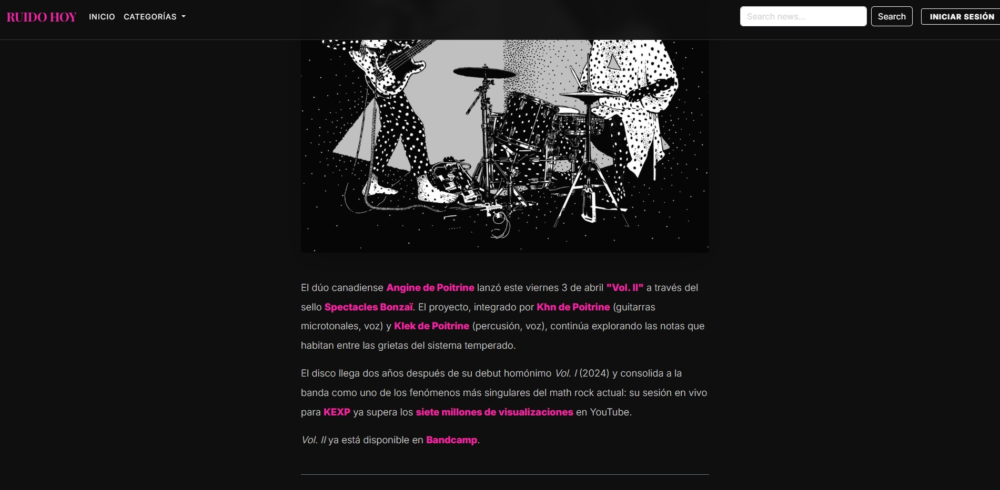
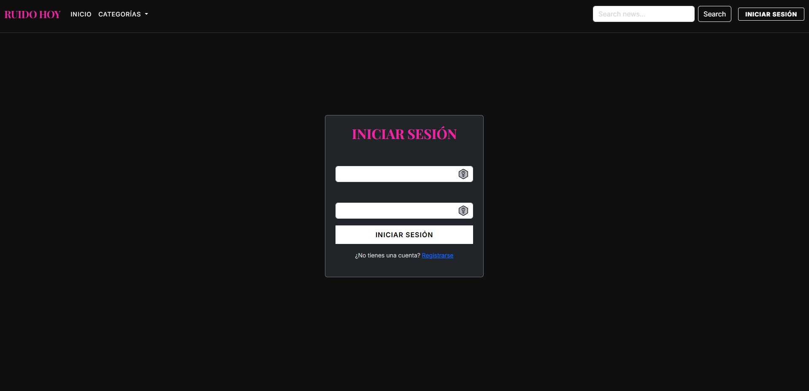
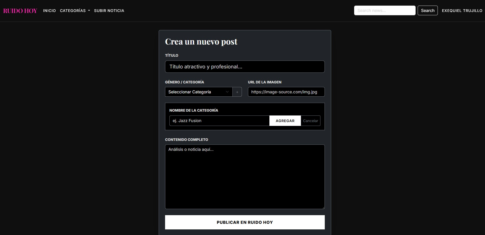

# RUIDO HOY | Blog de Noticias Musicales

**Ruido Hoy** es una plataforma diseñada para la gestión y difusión de noticias del mundo de la música. Este proyecto nace de la necesidad de ofrecer una experiencia fluida tanto para el lector como para el administrador, combinando un diseño minimalista "dark mode" con potentes funcionalidades de backend y frontend.

---

## Demo en vivo

[https://ruido-hoy.vercel.app/](https://ruido-hoy.vercel.app/)

**Screenshots:**






---

## Características Principales

### Motor de Búsqueda Difusa (Fuzzy Search)
Permite encontrar noticias incluso si el usuario comete errores ortográficos (tipeos) o busca términos parciales.

### Soporte de Markdown (Nativo)
Desarrollo de un **Parser de Markdown** básico desde cero en Vanilla JS. Soporta encabezados, negritas, cursivas y párrafos, permitiendo a los administradores publicar noticias con formato enriquecido sin depender de librerías externas pesadas.

### Seguridad Anti-Bots
Sistema de protección escalable mediante una tabla de estadísticas diarias (`DailyStats`). Limita el registro de usuarios y el posteo de comentarios a un máximo de **100 acciones/día**, previniendo ataques de spam y asegurando el rendimiento en entornos serverless como Vercel. Esta estrategia puede ser reemplazada en entornos que permitan uso de cronjobs con más recursos.

### Layout Dinámico y Componentes
Arquitectura modular con carga asíncrona de componentes (Navbar y Footer). Permite mantener un código limpio y una navegación instantánea sin recargas de página excesivas.

---

## Stack Tecnológico

- **Backend**: Node.js & Express.
- **Base de Datos**: PostgreSQL (con Sequelize ORM).
- **Frontend**: HTML5, CSS3 (Bootstrap 5.3 Custom UI) y Vanilla JavaScript.
- **Autenticación**: JWT (JSON Web Tokens) con roles de usuario (Admin/User).
- **Despliegue**: Optimizado para **Vercel** mediante arquitectura serverless.

---

## Instalación y Configuración

1.  **Clona el repositorio e instala dependencias**:
    ```bash
    git clone https://github.com/exetrujillo/ruido-hoy.git .
    npm install
    ```

2.  **Configura el entorno**:
    Crea un archivo `.env` en la raíz con las siguientes variables:
    ```env
    PORT=3000
    DATABASE_URL=tu_url_de_postgres
    JWT_SECRET=tu_secreto_seguro
    ```

3.  **Inicia el servidor**:
    ```bash
    # Para desarrollo
    npm run dev
    
    # Para producción
    npm start
    ```

---

## Autor

**Exequiel Trujillo**
*  [LinkedIn](https://www.linkedin.com/in/exequiel-trujillo/)
*  [GitHub](https://github.com/exetrujillo)

---

*Proyecto desarrollado como parte del módulo 9 del curso SENCE de Desarrollo Web Full Stack con JavaScript, enfocado en aplicaciones web modernas y seguras.*